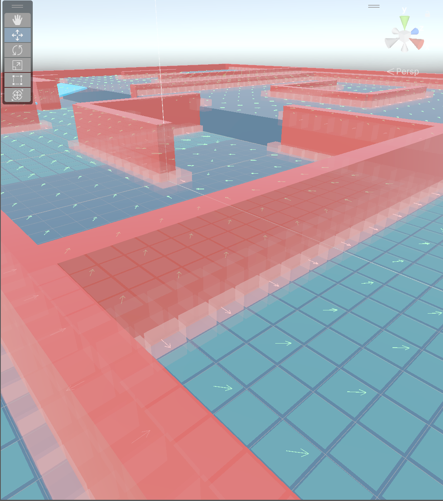
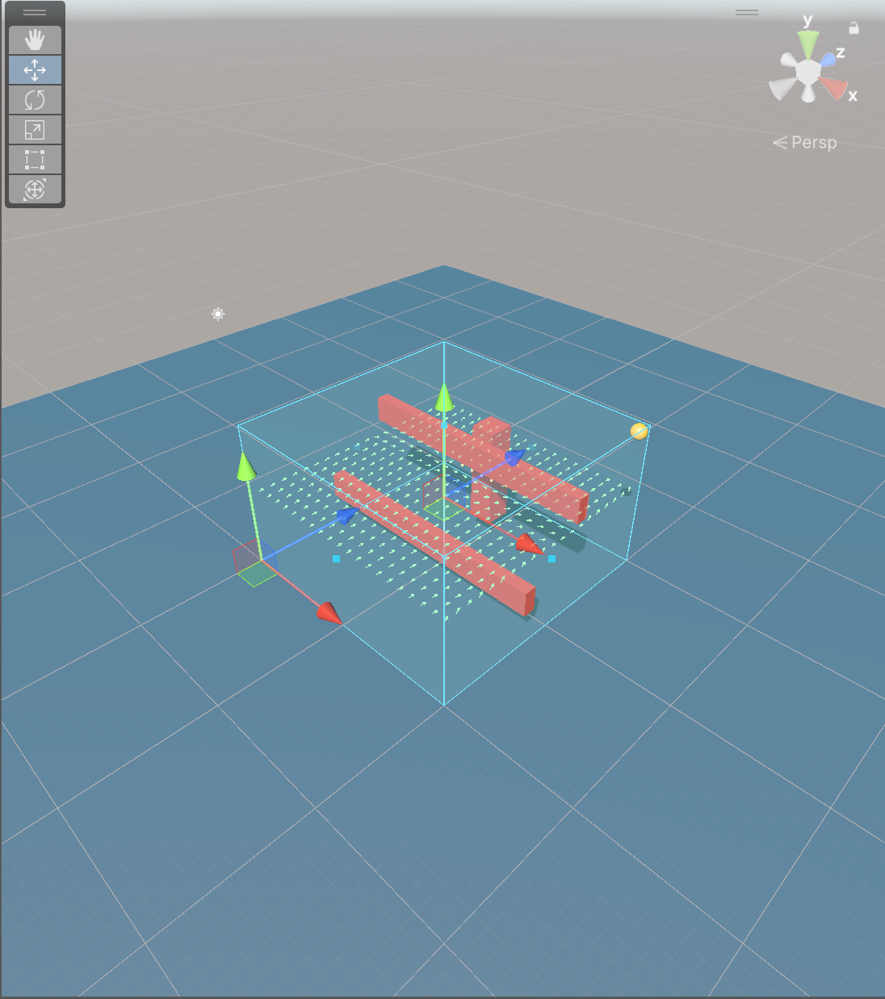

# FlowField 기술 참고

이 문서는 [FlowField README](../README.md)의 네 가지 기능 설명을 보완하는 구현 참고 문서입니다. 요청·수명·베이크·Editor 표시의 실제 책임을 구분하고, README에 표시하지 않은 보조 화면과 문서 갱신 검증 범위를 기록합니다.

## 어셈블리와 리소스 위치

- `Common.FlowField.Core`: 계약, 격자, 모드별 Session, 계산 단계, 결과 저장소와 Bake 데이터.
- `Common.FlowField.Runtime`: `FlowFieldManager`, Modifier 컴포넌트와 Unity 수명주기·실행 연결.
- `Common.FlowField.Editor`: Inspector, Bake 작업, Editor 시각화와 Editor 수명 처리.
- `Common.FlowField.Samples`: 공개 Provider·Controller를 사용하는 Agent, HUD와 샘플 카메라.
- `Common.FlowField.Tests`: 기존 Editor 테스트와 FlowField 회귀 검증.
- Compute Shader: `Assets/_FlowField/Script/Runtime/Core/Solvers/FlowFieldFrontier.compute`. Resources 폴더로 이동하지 않습니다.

프로젝트 기준 Unity 버전은 2023.2.20f1입니다. Collections, Mathematics, URP, UGUI 패키지 버전과 개별 asmdef 참조는 이 문서의 기능 설명과 분리해 프로젝트 설정에서 관리합니다.

## 수명·입력·샘플링

`FlowFieldManager`는 설정을 검증하고 Surface 또는 Volume Session을 준비한 다음 실행 경계에 작업을 등록합니다. `OnDisable`에서는 실행을 중단하고, `Release`·`OnDestroy`에서는 Session과 GPU 자원을 정리합니다. 최초 게시 결과가 없으면 `IsReady`가 false이며 `TrySample`은 미준비·영역 밖·안전성 검증 실패를 실패와 정지 샘플로 나타냅니다. 이동 주체는 이 결과를 정지 또는 감속으로 처리해야 합니다.

`FlowFieldSessionBase`는 공통 수명 세대, 최신 수락 `FlowFieldBuildRequest`, 게시 식별자와 이벤트 경계를 제공합니다. 실제 계산 요청은 모드별 `FlowFieldSessionRequest` 또는 `FlowFieldVolumeRequest`가 보관하고, Surface 배열·FieldStore와 Volume 작업 배열·게시 저장소는 각 자식 Session이 소유합니다.

RuntimeDynamic의 Goal·장애물·Modifier 변경은 후보 입력을 검증해 최신 요청에 반영한 뒤 샘플이 `RequestRebuild()`를 호출하는 흐름입니다. 진행 중인 작업의 고정 입력을 덮어쓰지 않습니다. StaticBaked에서는 Play Mode에 Goal·장애물 변경 API나 Editor의 Bake 저장 API를 호출하지 않고 Bake Asset을 로드합니다.

같은 Grid·Source의 읽을 수 있는 이전 결과가 있는 동안에는 해당 결과를 사용할 수 있습니다. Surface의 Revision은 실제 FieldStore 결과 변경 여부에 따라, Volume의 Revision은 완료된 결과 저장소 교체 정책에 따라 갱신됩니다. 두 모드의 Revision을 하나의 일반 규칙으로 해석하면 안 됩니다.

## Surface2D와 Volume3D 계산

Surface2D는 바닥 Raycast로 표면 높이·법선을 확보하고, 경사·단차·장애물 조건과 8방향 연결을 계산합니다. Scene View 표시 경로는 계산 결과와 별개로 표시 대상을 축약할 수 있습니다. 현재 100×100 격자는 2,500셀을 초과하므로 X·Z 두 칸 간격을 사용해 50×50개를 표시하며, 실제 계산 셀 수는 10,000개로 유지됩니다.

Volume3D는 Bounds 전체를 CellSize 정육면체 셀로 분할하고 `x + Width × (z + Depth × y)` 순서로 저장합니다. 26방향 동일 비용 BFS를 사용하고, 두 축·세 축 대각선은 중간 셀이 모두 통과 가능할 때만 연결합니다. FullVolume 표시 상한은 8,192셀, Slice 표시 상한은 4,096셀입니다. 표시 표본 수는 계산 격자나 샘플링 해상도를 변경하지 않습니다.

## Modifier와 GPU

등록 Registry는 Modifier 참조, 등록 순서, Priority·Revision과 Collider 관측을 관리합니다. Registry가 Snapshot을 직접 생성하는 것은 아닙니다. Surface는 Modifier Pipeline이 등록된 Modifier의 `CaptureSnapshot()`을 호출하고, Volume은 Volume Session의 작업 단계에서 고정 작업 집합을 만듭니다. Snapshot은 작업 중 설정값을 고정하지만 Collider 형상·Transform을 복제하는 물리 프록시는 아닙니다.

Surface Build Pipeline은 `IFlowFieldGpuBackend`를 통해 `FlowFieldComputeSolver`를 사용합니다. Volume Session은 자신의 Solver와 Volume 단계 실행을 관리합니다. `FlowFieldComputeSolver`는 GPU Backend 인터페이스의 구현 타입이 아니며 Solver가 내부 GPU·Readback 자원을 소유합니다.

Readback 콜백은 작업 식별자와 완료·실패 신호만 기록하고, 후속 Dispatch·대량 검증·Modifier 합성·게시를 직접 수행하지 않습니다. GPU를 사용할 수 없거나 결과 검증에 실패하면 동일하게 고정된 입력의 Managed 경로로 이어집니다.

Volume 작업은 `FlowFieldBuildScheduler`와 `FlowFieldBuildDriver`의 협력 실행 경계를 사용합니다. 탐색·방향 계산은 최대 64셀, 단순 배열 처리는 최대 4,096원소, Physics·Snapshot·Modify 호출은 1회 단위로 deadline을 확인합니다. 2ms는 협력 CPU 예산이며 전체 빌드 완료 시간이나 GPU 실행 시간의 보장이 아닙니다.

## StaticBaked와 Asset 검증

Surface2D는 `FlowFieldStaticBakeData`, Volume3D는 `FlowFieldVolumeBakeData` v5를 사용합니다. v4는 자동 변환하지 않고 명시적인 ReBake를 요구합니다. Asset의 구조 검증은 메타데이터·내용 세대·Revision을 기준으로 캐시할 수 있지만 Manager 설정 일치 검사는 별도로 수행합니다.

정적 로드에서는 저장된 내비게이션·Goal·NextCell·장애물 결과를 사용하며 Physics나 BFS를 다시 실행하지 않습니다. 로드 후 Default Direction과 Modifier의 최종 합성은 저장된 기본 데이터와 구분합니다. Payload 검증·Apply·저장에 실패한 경우 기존 Asset 내용·Revision·GUID를 보존해야 합니다.

## Editor 표시 경로

Surface2D의 비 Play Mode Scene View 미리보기는 표시 요청에 따라 SceneBuild 또는 StaticSnapshot 입력을 준비하고, 최초에는 독립 Preview Session이 계산을 수행할 수 있습니다. 같은 소스와 표시 설정을 다시 그릴 때는 완료된 표시 상태와 인덱스 캐시를 사용할 수 있습니다. 따라서 모든 Repaint에서 Physics·BFS·전체 복사가 0회라고 일반화하지 않습니다.

Play Mode의 Surface 표시는 Manager가 게시한 결과를 사용합니다. StaticBaked 여부에 따라 Asset의 내비게이션 데이터를 읽고 현재 Default Direction·Modifier 합성을 거친 최종 결과가 표시될 수 있으므로, 화면의 화살표를 Asset 원본 방향 배열과 동일하다고 설명하지 않습니다.

Volume3D 표시는 게시된 ReadView 또는 검증된 Bake View에서 선택 인덱스를 계산합니다. FullVolume과 Slice의 선택 상한을 적용하지만 표시를 위해 전체 Workspace를 복제하거나 탈출 BFS를 다시 실행하지 않습니다. 단면 축·인덱스 변경은 선택 목록과 Repaint만 갱신합니다.

### 추가 Editor 시각 자료

README의 네 번째 기능에는 대표 화면 두 장만 배치하고, 다음 세부 화면은 여기에서 제공합니다. 왼쪽은 Surface2D 통로 상세 미리보기, 오른쪽은 Volume3D 중앙 Y 단면입니다. 서로 다른 씬의 화면이므로 전후 상태 비교가 아닙니다.

<p align="center">
  
  
</p>

## UML과 문서 이미지 갱신

핵심 UML 원본은 [flowfield-uml.puml](flowfield-uml.puml), 렌더 결과는 [Images/flowfield-uml.png](Images/flowfield-uml.png)입니다. UML에는 공개 계약, Manager, 모드별 Session, 계산·저장·실행 경계만 포함하며 Editor·Samples·Camera는 포함하지 않습니다.

렌더 기준은 PlantUML 1.2024.6, Java 8, UTF-8, Smetana 레이아웃, Graphviz 미사용입니다. 저장소 밖의 PlantUML JAR를 사용해 다음처럼 갱신합니다.

```powershell
java -jar "C:\Temp\flowfield-doc-tools\plantuml-1.2024.6.jar"   -tpng   -charset UTF-8   -o Images   flowfield-uml.puml
```

현재 Docs/Images에는 기능 확인용 PNG 10장이 있습니다. README에는 베이킹·2D·3D·Editor 기능별 대표 화면 2장씩 8장을 연결하고, Surface 상세와 Volume Slice 2장은 이 문서에서만 연결합니다. Runtime 캡처는 3840×2160, Scene View 캡처는 저장된 Unity 패널 해상도를 유지하며 이미지 편집으로 화살표나 셀을 추가하지 않습니다.

## 검증 기록

### 기존 캡처 기록

- `feature-staticbaked-surface.png`와 `feature-staticbaked-volume.png`는 각각 2D·3D StaticBaked 로드 화면으로 사용합니다.
- `feature-surface2d-runtime-baseline.png`와 `feature-surface2d-runtime-rebuild.png`는 Surface2D RuntimeDynamic의 기본·재빌드 화면으로 사용합니다.
- `feature-volume3d-runtime-baseline.png`와 `feature-volume3d-runtime-gate.png`는 Volume3D RuntimeDynamic의 기본·Gate 변경 화면으로 사용합니다.
- `feature-surface2d-editor-overview.png`와 `feature-surface2d-editor-detail.png`는 Surface2D Scene View 전체·상세 화면으로 사용합니다.
- `feature-volume3d-editor-full-volume.png`와 `feature-volume3d-editor-slice.png`는 Volume3D FullVolume·Slice 화면으로 사용합니다.

### 이번 문서 갱신에서 확인할 항목

- README에 네 개 기능 제목이 지정된 순서로 존재하고, 각 기능에 이미지가 정확히 두 장씩 연결되는지 확인합니다.
- README에는 UML 1장과 기능 이미지 8장만 있어 ``가 총 9개인지 확인합니다. 이 문서의 보조 이미지는 README 수에 포함하지 않습니다.
- PlantUML 렌더 종료 코드, PNG 존재 여부, 24개 핵심 타입과 Editor·Samples·Camera 타입 제거 여부를 확인합니다.
- README·TechnicalNotes의 상대 이미지·PlantUML·문서 링크와 모든 PNG 파일의 존재 여부를 확인합니다.
- 수정 허용 파일 밖의 코드·씬·Prefab·Bake Asset·ProjectSettings와 기존 이미지 `.meta`가 변경되지 않았는지 확인합니다.
- `git diff --check`를 실행합니다.

이번 작업은 문서와 UML 갱신 범위이므로 Unity PlayMode 재실행, 새 Bake/ReBake, Core 자동 테스트, GPU 일치 검증과 성능 프로파일을 새로 수행하지 않습니다. 이러한 항목은 통과로 기록하지 않습니다.
