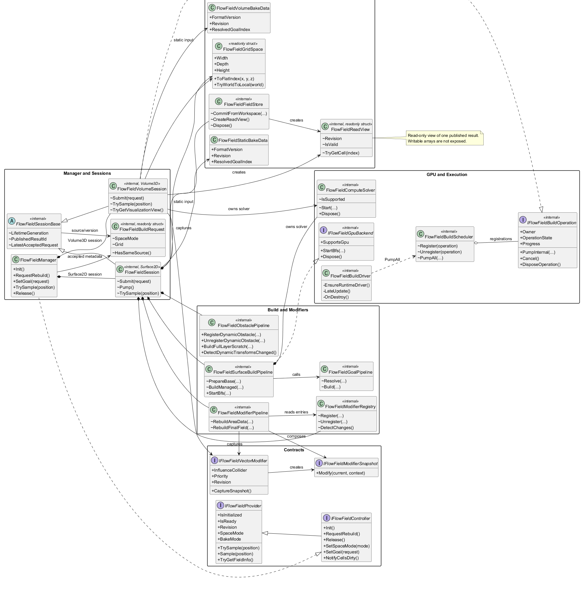
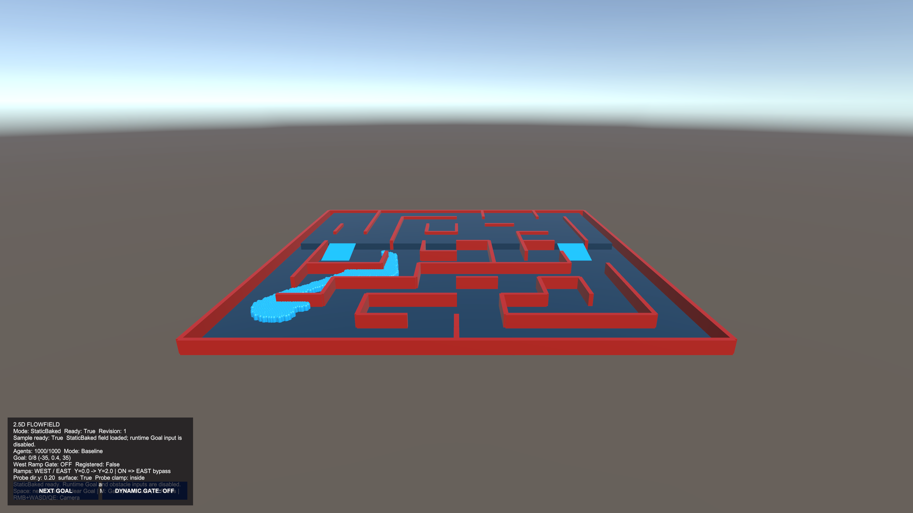
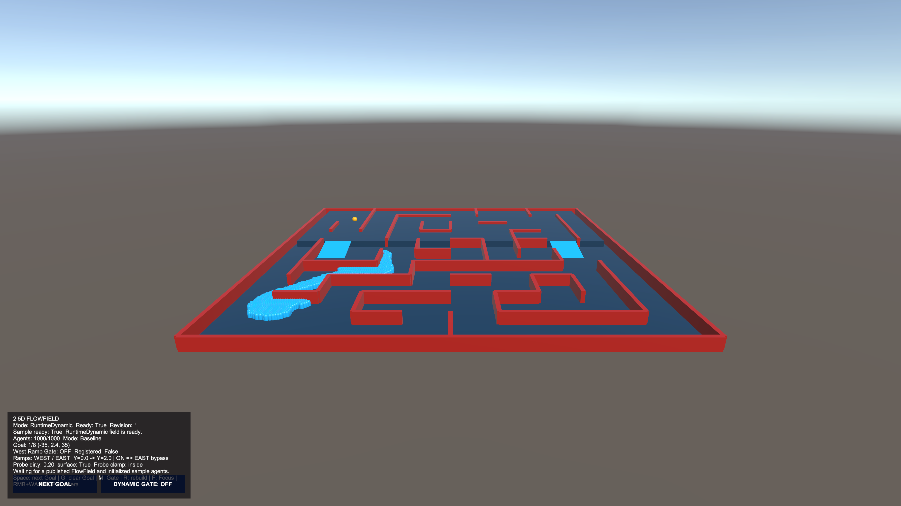
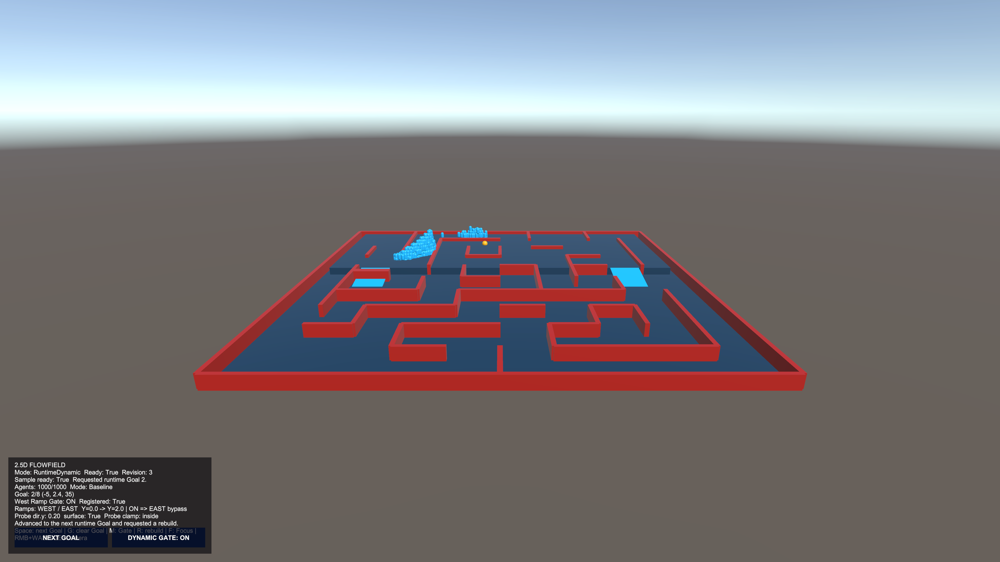
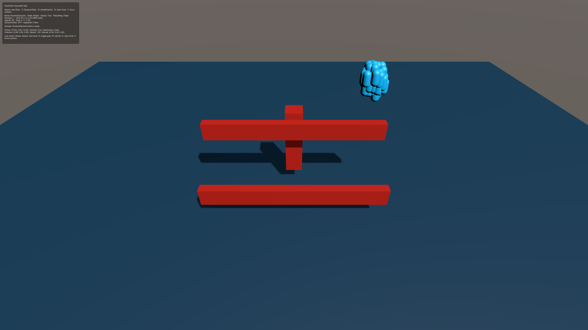
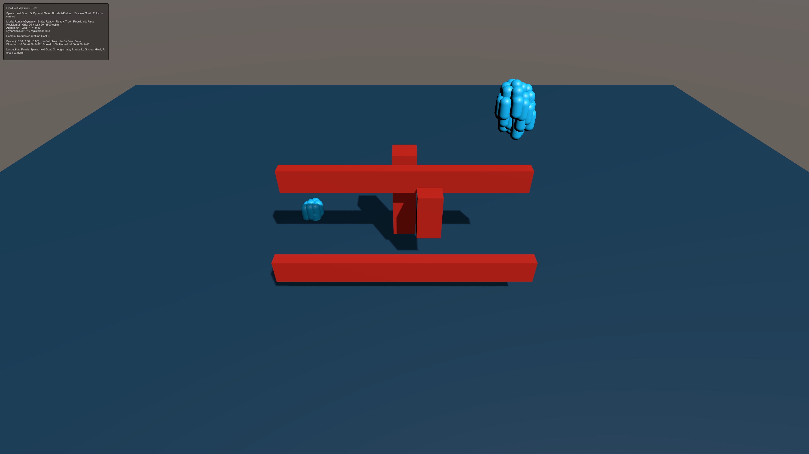
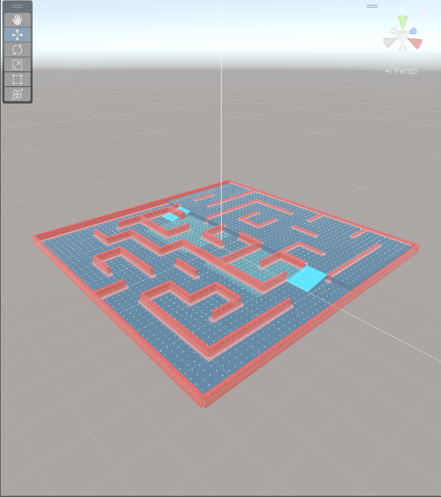
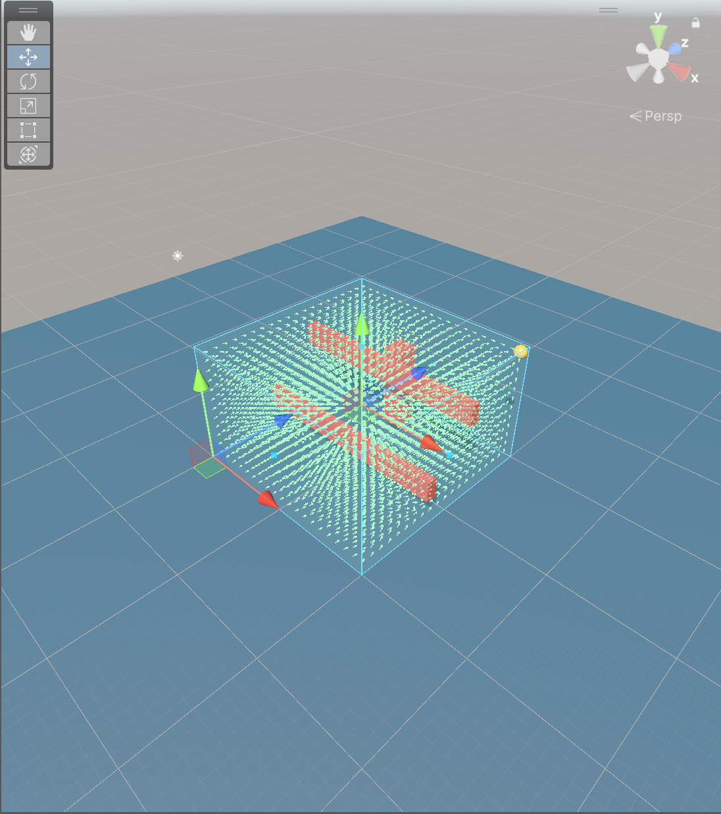

# FlowField

씬의 장애물과 Goal을 기준으로 이동 가능한 공간에 방향과 속도 배율을 제공하는 Unity 방향장 시스템입니다. `Surface2D`는 바닥 표면을, `Volume3D`는 Bounds 내부의 정육면체 셀을 계산하며 `RuntimeDynamic`과 `StaticBaked` 실행 모드를 지원합니다. 이동 주체는 자신의 업데이트 주기에서 게시된 Field를 조회해 이동에 적용합니다.

## 목차

- [프로젝트 개요](#프로젝트-개요)
- [프로젝트 요약](#프로젝트-요약)
- [클래스 다이어그램](#클래스-다이어그램)
- [기능 상세](#기능-상세)

## 프로젝트 개요

| 항목 | 내용 |
| --- | --- |
| 개발 인원 | 1명 — 유원석 (You Won Sock) |
| GitHub | [youwonsock](https://github.com/youwonsock) |
| 이메일 | qazwsx233434@gmail.com |
| 프로젝트 목적 | 표면·볼륨 기반 방향장 계산, 정적 베이크, 런타임 샘플링과 Unity 실행 검증 |
| 개발 언어 | C# 및 Compute Shader |
| 개발 도구 | Unity 2023.2.20f1, Visual Studio 또는 Rider |
| 샘플 표시 환경 | Universal Render Pipeline 16.0.6, UGUI (방향장 런타임과 분리) |
| 런타임 어셈블리 | `Common.FlowField.Core`, `Common.FlowField.Runtime` |
| 에디터·샘플 어셈블리 | `Common.FlowField.Editor`, `Common.FlowField.Samples` |

## 프로젝트 요약

FlowField는 Manager가 작성 설정과 현재 입력을 확인한 뒤 Surface2D 또는 Volume3D 전용 계산 요청을 만들고, 모드별 Session이 계산 또는 StaticBaked 데이터 로드를 수행합니다. 완성된 기본 필드에 필요한 Default Direction과 Modifier를 적용한 결과만 게시하며, 이동 주체는 게시된 결과를 읽어 자신의 이동을 결정합니다.

1. `FlowFieldManager`가 Bounds·CellSize·공간 모드·Goal·장애물·Modifier 설정을 수집합니다.
2. Surface2D는 표면 데이터와 8방향 탐색을, Volume3D는 XYZ 셀과 26방향 탐색을 사용하는 모드별 요청을 실행합니다.
3. RuntimeDynamic은 장애물·Goal 변경을 최신 요청에 반영하고, 입력 확정 후 `RequestRebuild()`로 계산을 시작합니다. StaticBaked는 저장된 Bake Asset을 로드합니다.
4. 계산 결과에 Default Direction과 작업별 Modifier Snapshot을 합성합니다.
5. Surface2D는 `FlowFieldFieldStore`, Volume3D는 모드 전용 결과 저장소에 완성된 필드를 게시합니다.
6. `IFlowFieldProvider`가 방향·속도·상태를 읽기 전용으로 제공하고, 이동 주체가 이를 자신의 업데이트에서 적용합니다.

런타임 흐름

```text
Manager 설정·Goal·Obstacle·Modifier
  → Surface / Volume 전용 계산 요청
  → 모드별 Session의 계산 또는 StaticBaked 로드
  → Default Direction·Modifier 합성
  → Surface FieldStore / Volume 결과 저장소 게시
  → IFlowFieldProvider 조회
  → 이동 주체의 이동·감속 적용
```

`FlowFieldSessionBase`는 수명 세대, 최신 수락 입력의 공통 메타데이터와 게시 이벤트 경계를 제공하고 실제 배열·계산 단계는 모드별 Session이 소유합니다. 같은 Grid·Source의 읽을 수 있는 이전 결과가 있으면 계산 중에도 이를 사용할 수 있으며, 새 결과의 공개 여부는 각 모드의 Commit 정책에 따라 결정됩니다. `Init`·`Release`는 멱등적으로 처리되고 일반 입력 명령은 즉시 중첩 계산을 실행하지 않습니다. 자세한 수명·베이크·실행 제약은 [Docs/TechnicalNotes.md](Docs/TechnicalNotes.md)에서 확인할 수 있습니다.

## 클래스 다이어그램



원본 PlantUML: [Docs/flowfield-uml.puml](Docs/flowfield-uml.puml)

다이어그램은 방향장 계산의 입력 계약, Manager 진입점, 모드별 Session, 격자·게시 저장소, Modifier·GPU 실행 경계를 보여줍니다. Editor Inspector, Scene View 도구, Samples와 같은 Unity 연결 보조 타입 및 세부 DTO는 가독성을 위해 생략했습니다.

핵심 관계

- `FlowFieldManager`는 `IFlowFieldController`를 구현하고 설정에 따라 `FlowFieldSession` 또는 `FlowFieldVolumeSession`을 사용합니다.
- `FlowFieldSessionBase`는 공통 수명 세대·수락 메타데이터·게시 이벤트 경계를 제공하며 Surface와 Volume의 실제 계산 상태와 저장소는 각 자식 Session에 남습니다.
- `FlowFieldSession`은 Surface FieldStore, 장애물 Pipeline, Modifier Registry·Pipeline을 소유하고 `FlowFieldSurfaceBuildPipeline`을 통해 표면 계산을 수행합니다.
- `FlowFieldSurfaceBuildPipeline`은 Goal Pipeline과 GPU Backend를 사용하며, `FlowFieldComputeSolver`의 결과를 같은 입력의 Managed 경로로 처리할 수 있습니다.
- `FlowFieldVolumeSession`은 Volume 셀·26방향 탐색·결과 저장소와 자신의 Compute Solver를 관리하고 `IFlowFieldBuildOperation`으로 협력 실행기에 참여합니다.
- `FlowFieldModifierRegistry`는 등록·Priority·Revision·Collider 관측을 관리하며 Snapshot 캡처와 최종 합성은 각 모드의 Modifier 처리 경로가 수행합니다.
- `FlowFieldFieldStore`와 Volume 전용 저장소는 완성된 결과에서 `FlowFieldReadView`를 제공하며 쓰기 가능한 배열을 외부 계약으로 노출하지 않습니다.

### 클래스별 역할

- `IFlowFieldProvider`·`IFlowFieldController`: 게시 상태를 조회하고 초기화·재빌드·Goal·장애물·Modifier 명령을 전달하는 공개 계약입니다.
- `IFlowFieldVectorModifier`·`IFlowFieldModifierSnapshot`: Modifier의 등록 메타데이터와 작업별 고정 계산을 분리합니다.
- `FlowFieldManager`: 직렬화 설정과 Unity 수명주기를 읽고 공개 Provider·Controller 계약을 런타임 Session에 연결합니다.
- `FlowFieldSessionBase`: 공통 수명 세대, 최신 수락 BuildRequest, 게시 식별자와 이벤트 경계를 관리합니다. 모드별 상태·배열·Revision 정책은 자식이 결정합니다.
- `FlowFieldSession`: Surface2D Raycast, 높이·법선·경사·단차 검사, 8방향 탐색과 Surface 결과 게시를 담당합니다.
- `FlowFieldVolumeSession`: Volume3D 정육면체 셀, 장애물 상태, 26방향 BFS, 코너 차단, 탈출 방향과 Volume 결과 게시를 담당합니다.
- `FlowFieldBuildRequest`: 실제 Solver 입력 전체가 아니라 수락된 Grid·Source·버전·Goal 비교에 필요한 공통 메타데이터를 담습니다. Surface와 Volume의 세부 요청은 모드별 입력 타입이 유지합니다.
- `FlowFieldGridSpace`: 월드 좌표와 XYZ 셀 좌표, `x + Width × (z + Depth × y)` 평탄화, 경계·Clamp 변환을 제공합니다.
- `FlowFieldFieldStore`·`FlowFieldReadView`: Surface 게시 결과를 저장하고 한 번의 읽기 구간에서 셀 방향·속도·상태를 조회하게 합니다. Volume도 동일한 ReadView 계약으로 자신의 저장 결과를 제공합니다.
- `FlowFieldStaticBakeData`·`FlowFieldVolumeBakeData`: Surface2D·Volume3D의 v5 정적 내비게이션 입력을 저장하고 StaticBaked Session에 제공합니다.
- `FlowFieldSurfaceBuildPipeline`·`FlowFieldGoalPipeline`·`FlowFieldObstaclePipeline`: Surface의 표면 준비, Goal 해석·탐색, 장애물·Dirty 처리 단계를 분리합니다.
- `FlowFieldModifierRegistry`·`FlowFieldModifierPipeline`: 등록 순서·Priority·Revision을 관찰하고 작업 Snapshot을 영향 영역과 최종 방향·속도에 합성합니다.
- `IFlowFieldGpuBackend`·`FlowFieldComputeSolver`: GPU BFS 시작·완료 경계와 Compute Shader·AsyncGPUReadback 자원을 담당합니다. Solver는 Backend 인터페이스의 구현체가 아닙니다.
- `IFlowFieldBuildOperation`·`FlowFieldBuildScheduler`·`FlowFieldBuildDriver`: Volume 작업을 등록하고 준비된 작업만 협력 예산 안에서 순서대로 진행합니다. Scheduler는 작업 등록을 관리하며 Session 수명 전체를 소유하지 않습니다.

## 기능 상세

### FlowField 베이킹

**목적**

Editor에서 씬의 표면 또는 3D 볼륨을 미리 계산해 v5 Bake Asset으로 저장하고, Play Mode의 StaticBaked Session이 저장된 내비게이션 결과를 빠르게 로드하도록 합니다. Surface2D 베이크 결과는 2D 샘플 씬에서, Volume3D 베이크 결과는 3D 테스트 씬에서 확인합니다.

**핵심 구현**

- Surface2D는 `FlowFieldStaticBakeData`, Volume3D는 `FlowFieldVolumeBakeData`에 모드별 격자와 탐색 결과를 저장합니다.
- Editor에서 설정·Goal·장애물 입력을 확인한 뒤 Bake/ReBake하고, StaticBaked 실행에서는 저장된 Asset을 읽습니다.
- StaticBaked Play Mode에서는 샘플이 Goal·동적 장애물을 변경하거나 Bake Asset을 저장하지 않습니다.
- Default Direction과 Modifier 합성은 저장된 기본 내비게이션 데이터 로드 이후의 런타임 처리로 구분합니다.
- 왼쪽은 2D 씬의 Surface2D StaticBaked 로드 결과, 오른쪽은 3D 씬의 Volume3D StaticBaked 로드 결과입니다.

<p align="center">
  
  
</p>

### 2D FlowField

**목적**

바닥 표면을 따라 이동하는 주체를 위해 Raycast 기반 Surface2D 방향장을 생성합니다. 표면 높이·법선과 경사·단차·장애물 조건을 계산해 8방향 이웃 중 Goal로 향하는 흐름을 제공합니다.

**핵심 구현**

- Surface 격자는 XZ 평면에 배치하고 각 셀의 바닥 높이와 표면 상태를 별도로 보관합니다.
- RuntimeDynamic에서 Goal·동적 장애물 입력을 확정한 뒤 `RequestRebuild()`를 명시적으로 호출합니다.
- Agent는 Provider의 방향·속도를 자신의 업데이트에서 적용하고 미준비·영역 밖 결과에서는 정지 또는 감속합니다.
- 왼쪽은 기본 Ready 상태, 오른쪽은 Goal·장애물 입력 변경 후 새 Revision이 게시된 상태를 보여줍니다.

<p align="center">
  
  
</p>

### 3D FlowField

**목적**

바닥에 제한되지 않는 이동을 위해 설정한 Bounds 전체를 CellSize 정육면체 셀로 채우고 XYZ 방향장을 생성합니다. 비행 주체가 상하 Goal과 장애물을 입체적으로 우회할 수 있도록 합니다.

**핵심 구현**

- 테스트 격자 `20×12×20`을 `4,800`개 셀로 만들며 개별 셀 GameObject는 생성하지 않습니다.
- 26방향 동일 비용 BFS와 대각선 중간 셀 통과 검사를 사용해 코너가 막힌 대각선 이동을 차단합니다.
- RuntimeDynamic에서는 Goal Y 변경과 DynamicGate 등록을 확정한 뒤 한 번의 `RequestRebuild()`로 최신 요청을 실행합니다.
- 방향장 계산은 Agent의 이동 벡터를 제공하며 Agent 간 충돌 회피는 별도 책임입니다.
- 왼쪽은 기본 64 Agent 실행, 오른쪽은 Gate와 Y축이 다른 Goal을 반영한 실행 상태입니다.

<p align="center">
  
  
</p>

### Editor 시각화

**목적**

계산 결과를 Editor Scene View에서 확인할 수 있도록 Surface2D 미리보기와 Volume3D FullVolume 표시를 제공합니다. 표시용 표본 수와 실제 계산 격자를 구분해, 큰 필드에서도 화면 가독성을 유지합니다.

**핵심 구현**

- Surface2D는 표면 위 방향장을 표시하고, 현재 100×100 격자는 두 칸 간격으로 50×50개 대상을 선택합니다. 표시 대상 축약은 계산 해상도를 변경하지 않습니다.
- Volume3D FullVolume은 최대 8,192셀, Slice는 최대 4,096셀을 표시하며 실제 테스트 격자 `20×12×20`은 12개 Y층을 포함한 4,800셀을 표시합니다.
- Volume 표시에서는 셀 경계를 숨기고 방향 화살표와 정지 표식을 중심으로 확인할 수 있습니다. Surface의 표시 규칙과 동일하다고 가정하지 않습니다.
- 왼쪽은 Surface2D 전체 영역의 축약된 방향장 미리보기, 오른쪽은 Volume3D 전체 층의 방향장입니다. Surface 상세 화면과 Volume 중앙 Y 단면은 [TechnicalNotes.md](Docs/TechnicalNotes.md)에서 확인합니다.

<p align="center">
  
  
</p>
