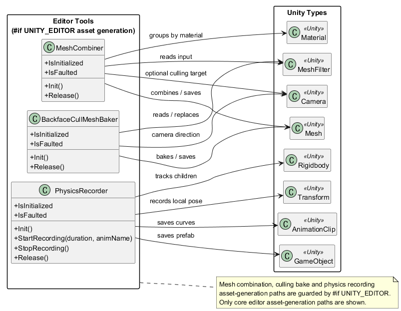
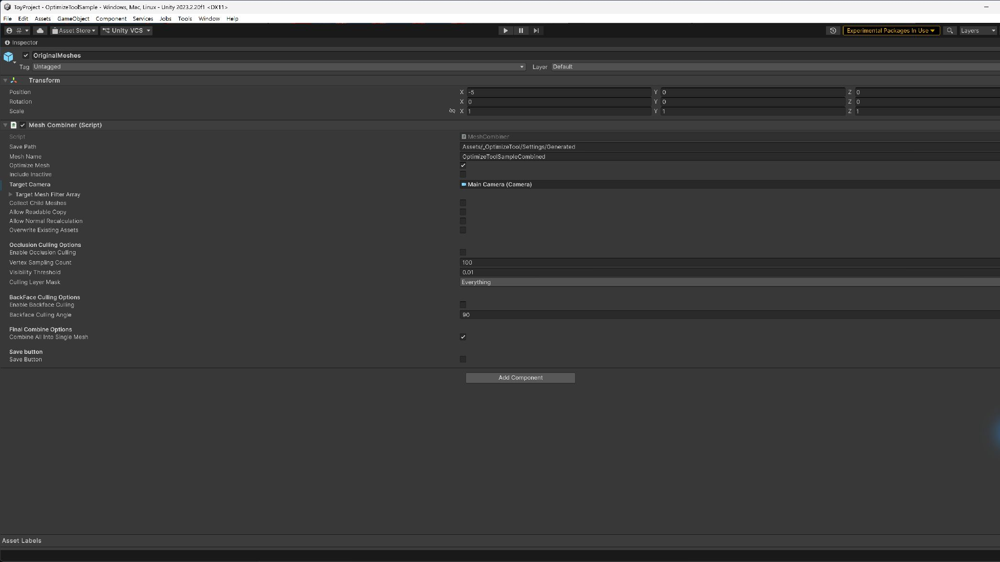
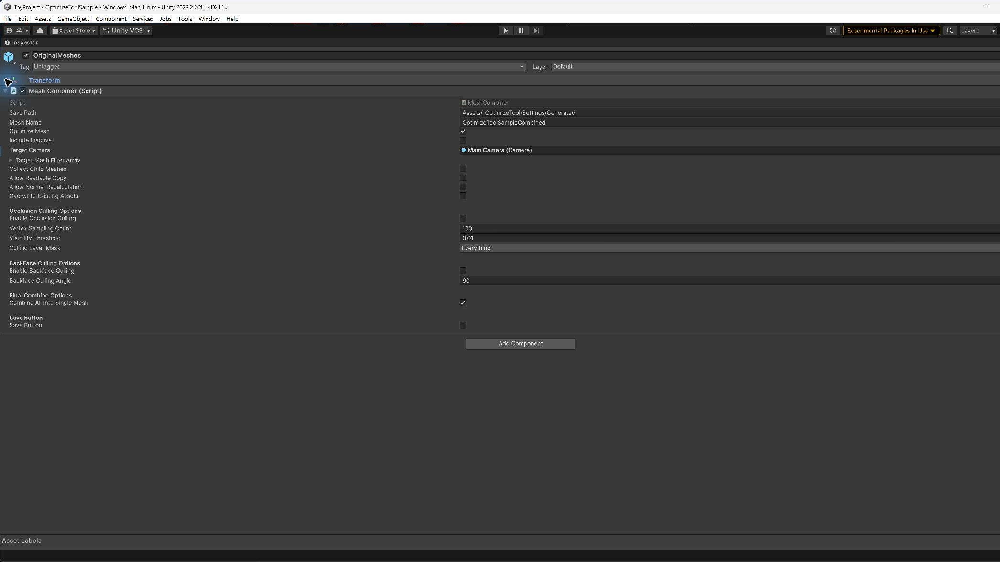
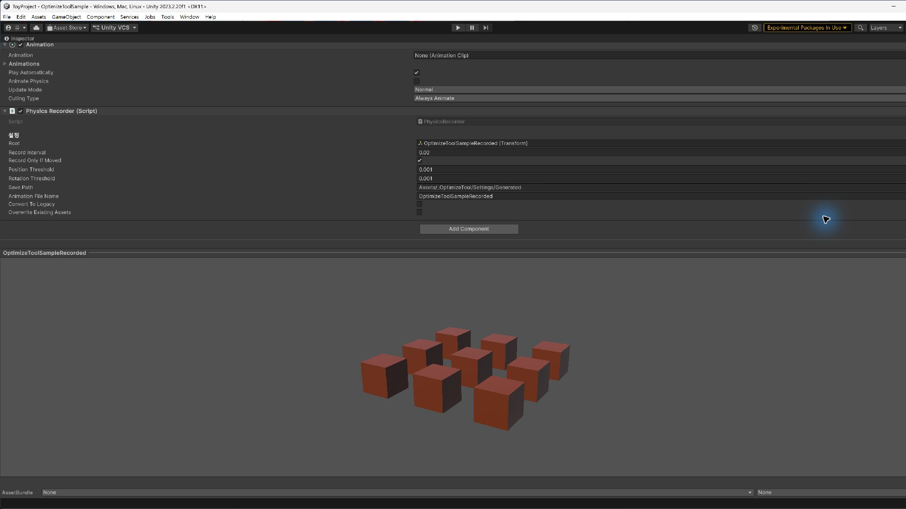

# OptimizeTool

Unity Editor에서 Mesh 결합·컬링·물리 움직임 기록을 수행하고, 결과를 재사용 가능한 Unity 에셋으로 저장하는 도구 모음입니다. 핵심 에셋 생성 로직은 `Common.OptimizeTool` 네임스페이스와 `#if UNITY_EDITOR` 범위에 포함됩니다.

## 목차

- [프로젝트 개요](#프로젝트-개요)
- [프로젝트 요약](#프로젝트-요약)
- [클래스 다이어그램](#클래스-다이어그램)
- [기능 상세](#기능-상세)

## 프로젝트 개요

| 항목 | 내용 |
| --- | --- |
| 개발 인원 | 1명 — 유원석 (You Won Sock) |
| GitHub | [youwonsock](https://github.com/youwonsock) |
| 이메일 | qazwsx233434@gmail.com |
| 프로젝트 목적 | Mesh 결합·컬링·물리 움직임을 Unity 에셋으로 생성하는 에디터 도구 구현 |
| 개발 언어 | C# |
| 개발 도구 | Unity 2023.2.20f1, Visual Studio 또는 Rider |
| 실행 환경 | Universal Render Pipeline 16.0.6, Unity Editor |
| 핵심 네임스페이스 | `Common.OptimizeTool` |

## 프로젝트 요약

OptimizeTool은 MeshFilter와 Rigidbody를 입력으로 받아 설정을 검증하고, Mesh·AnimationClip·Prefab을 에셋으로 저장하는 에디터 도구 모음입니다.

1. `MeshCombiner`가 직접 지정된 `MeshFilter` 또는 자식 계층에서 대상을 수집하고 입력·출력 설정을 검증합니다.
2. Readable Mesh와 Normal 데이터를 준비하고, 허용된 설정에 따라 임시 복사 또는 Normal 재계산을 수행합니다.
3. 선택적으로 Vertex Raycast 기반 Occlusion Culling과 각도 기반 Backface Culling을 적용한 뒤 Material·SubMesh별로 Geometry를 결합합니다.
4. `BackfaceCullMeshBaker`가 개별 Mesh의 삼각형을 카메라 방향 또는 사용자 지정 벡터 기준으로 검사해 별도 Mesh 에셋을 저장합니다.
5. `PhysicsRecorder`가 Rigidbody의 로컬 Transform을 기록해 AnimationClip을 저장하고, 기록 대상의 Prefab 저장 절차를 시작합니다.

핵심 처리 흐름

```text
Mesh 처리
MeshFilter 수집 → 설정·입력 검증 → Readable·Normal 처리
  → 선택적 Occlusion / Backface 처리 → Material별 SubMesh 결합
  → 설정된 Assets/ 하위 출력 폴더에 Mesh 에셋 저장

물리 기록
Rigidbody 추적 → localPosition / localRotation 기록
  → 위치·회전 임계값 기반 프레임 축약 → AnimationClip(.anim) 저장
  → 기록용 TempParent.prefab 저장 절차 시작
```

각 핵심 도구의 `Init`은 직렬화된 설정과 출력 경로를 확인하고, 실제 Mesh 데이터의 Readable·Normal 검증은 처리 단계에서 수행합니다. 초기화에 실패하면 fault 상태가 되며, `Release` 호출 후 다시 초기화할 수 있습니다. `PhysicsRecorder`는 기록 중 `Release`가 호출되면 `StopRecording()`을 먼저 수행하므로 일반적인 캐시 해제와 기록 종료·저장을 구분합니다. 출력 폴더와 파일명은 도구별 직렬화 설정을 사용하며, 기존 에셋은 overwrite 옵션이 허용된 경우에만 갱신합니다.

## 클래스 다이어그램



`OptimizeTool.uml`을 PlantUML로 렌더링한 코어 관계도입니다. 다이어그램에는 에셋을 생성하는 세 핵심 도구와 각 도구가 읽거나 저장하는 Unity 타입만 표시합니다.

핵심 관계

- `MeshCombiner`는 `MeshFilter` 입력을 검증하고 Material·SubMesh 단위로 `Mesh`를 결합·저장하며, 설정에 따라 Camera를 컬링 기준으로 사용합니다.
- `BackfaceCullMeshBaker`는 `MeshFilter`의 삼각형을 Camera 방향 또는 사용자 지정 벡터 기준으로 베이크하고 결과 Mesh로 교체합니다.
- `PhysicsRecorder`는 Rigidbody 자식의 Transform 로컬 위치·회전을 기록해 `AnimationClip`과 기록용 `GameObject` Prefab을 저장합니다.

### 클래스별 역할

- `MeshCombiner`: MeshFilter 입력 수집, Readable·Normal 검증, 컬링 적용, Material별 Mesh 결합과 에셋 저장을 담당합니다.
- `BackfaceCullMeshBaker`: 방향 기반 삼각형 제거, 결과 Mesh 저장, 입력 `MeshFilter.sharedMesh` 교체를 담당합니다.
- `PhysicsRecorder`: Rigidbody Transform 기록, AnimationCurve를 이용한 AnimationClip 저장, 기록용 Prefab 저장 절차를 담당합니다.

## 기능 상세

### Mesh 결합과 출력 에셋 생성

**목적**

여러 MeshFilter의 Geometry를 Material별로 결합해 Renderer와 Mesh 관리 단위를 줄이고, 결과를 재사용 가능한 Unity Mesh 에셋으로 저장합니다.

**핵심 구현**

- `_targetMeshFilterArray`로 대상을 직접 지정하거나 `_collectChildMeshes`로 자식 계층을 수집할 수 있으며, 두 입력 방식을 동시에 사용할 수는 없습니다.
- 입력 MeshFilter, MeshRenderer, Material, SubMesh, Triangle 인덱스를 처리 전에 검증합니다. Normal 데이터가 불완전하면 `_allowNormalRecalculation`이 켜진 경우에만 필요한 범위를 재계산합니다.
- Read/Write가 비활성화된 입력 Mesh는 `_allowReadableCopy`가 켜진 경우에만 임시 readable copy를 사용하며, 작업 후 임시 데이터를 정리합니다.
- 같은 Material의 SubMesh를 `CombineInstance`로 그룹화해 Material별 결과를 유지하고, `_combineAllIntoSingleMesh`가 켜지면 최종적으로 하나의 Mesh로 다시 결합합니다.
- `_optimizeMesh`가 켜져 있으면 최종 Mesh에 Unity Mesh 최적화를 적용하고 Bounds를 다시 계산합니다.
- 결과 이름은 단일 출력에서 `_meshName.asset`, 여러 출력에서 `_meshName_0.asset` 형식으로 검증하며, 기존 에셋은 `_overwriteExistingAssets`가 켜진 경우에만 갱신합니다.

<p align="center">
  
</p>

### Vertex Raycast 기반 Occlusion Culling

**목적**

카메라에서 Mesh의 표본 Vertex로 Raycast를 보내 MeshFilter 전체가 다른 Geometry에 가려졌는지 판단하고, 완전히 가려진 MeshFilter를 결합 대상에서 제외합니다.

**핵심 구현**

- `_targetCamera`에서 각 표본 Vertex까지 Raycast를 수행하고 `_cullingLayerMask`에 지정된 레이어만 Occluder로 사용합니다.
- Vertex 수가 `_vertexSamplingCount` 이하이면 모든 Vertex를 검사하고, 더 많으면 균등한 간격으로 표본을 추출합니다.
- 보이는 표본 비율이 `_visibilityThreshold`보다 작으면 MeshFilter 전체를 결합 입력에서 제외합니다. 삼각형을 개별 삭제하는 방식은 아닙니다.
- Occlusion을 활성화하려면 Camera, 양수 샘플 수, `0..1` 범위의 visibility threshold, 유효한 LayerMask가 필요합니다.
- Occlusion 설정은 MeshCombiner의 선택적 입력 필터 단계에서 적용되며, 별도의 Occlusion Mesh 에셋을 베이크하는 기능이 아닙니다.

<p align="center">
  
</p>

### Backface Culling과 Mesh 베이크

**목적**

특정 카메라 방향에서 보이지 않는 삼각형을 제거한 Mesh를 새 에셋으로 베이크해 렌더링할 Geometry를 줄입니다.

**핵심 구현**

- `MeshCombiner`는 결합 과정에서 `_enableBackfaceCulling`과 `_backfaceCullingAngle`을 사용해 카메라 기준 Backface 옵션을 적용할 수 있습니다.
- 별도 `BackfaceCullMeshBaker`는 각 삼각형의 World-space Normal과 카메라 방향의 각도를 비교해 보이는 삼각형만 새 Mesh에 복사합니다.
- `BackfaceCullMeshBaker`의 `_useCustomVector`가 꺼져 있으면 `_targetCamera.transform.forward`를 사용하고, 켜져 있으면 `_customCameraVector`를 사용합니다. 사용자 지정 벡터를 사용해도 대상 Camera 참조와 나머지 입력 검증은 필요합니다.
- 입력 Mesh의 Normal이 없으면 `_allowNormalRecalculation`이 켜진 경우에만 삼각형을 기준으로 Normal을 재계산합니다.
- 결과는 입력 MeshFilter 이름에 `_BackfaceCulled`를 붙인 `.asset`으로 저장하고 성공하면 해당 `MeshFilter.sharedMesh`를 교체합니다. 출력 충돌이나 모든 삼각형이 제거되는 입력은 변경 전에 중단합니다.

<p align="center">
  
</p>

### PhysicsRecorder 움직임 기록

**목적**

물리 시뮬레이션으로 움직인 Rigidbody 계층을 AnimationClip으로 변환해 런타임 물리 계산 없이 재생할 수 있는 출력 에셋으로 보관합니다.

**핵심 구현**

- `_root` 아래의 Rigidbody를 추적하고 `_recordInterval` 간격으로 각 Transform의 `localPosition`과 `localRotation`을 기록합니다.
- `_recordOnlyIfMoved`가 켜져 있으면 `_positionThreshold`와 `_rotationThreshold`보다 작은 변화는 새 프레임으로 기록하지 않습니다.
- `StartRecording(float duration, string animName = null)`은 양수 duration을 받아 기록 프레임과 추적 테이블을 초기화합니다.
- `StopRecording()`은 기록을 종료하고 AnimationCurve를 `.anim`으로 저장한 뒤 추적 오브젝트의 `TempParent.prefab` 저장 코루틴을 시작합니다. `_convertToLegacy`와 `_overwriteExistingAssets`로 출력 형식을 제어합니다.
- 기록 중 `Release()`가 호출되면 `StopRecording()`을 먼저 수행하므로, Clip 저장과 후속 Prefab 저장 코루틴의 완료 시점을 구분해야 합니다.
- `TempParent.prefab`은 기록 대상 계층을 복제한 뒤 Animation 컴포넌트에 저장된 Clip을 연결해 생성하며, 다른 샘플용 Prefab이나 쇼케이스 자산과는 별개의 핵심 Recorder 출력입니다.

<p align="center">
  
</p>
