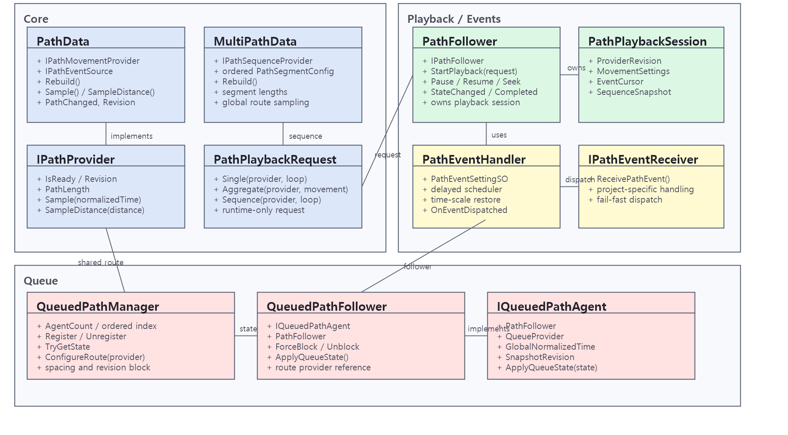
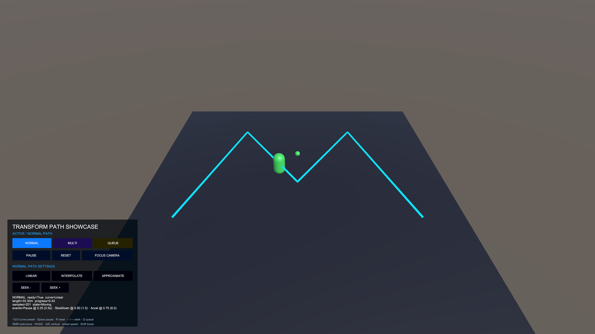
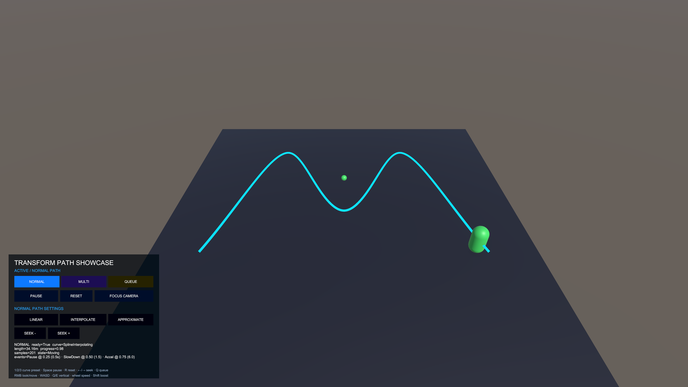
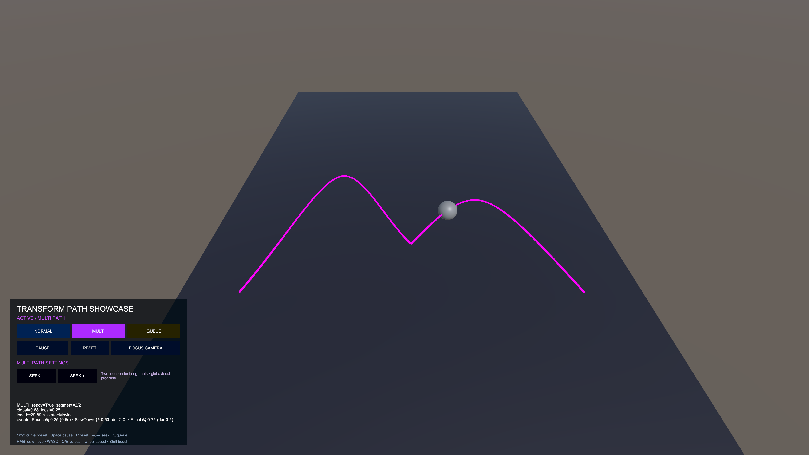
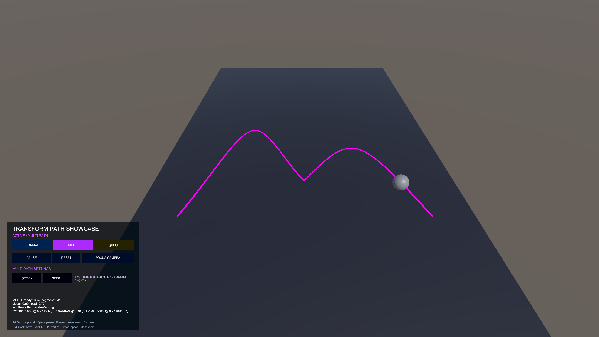
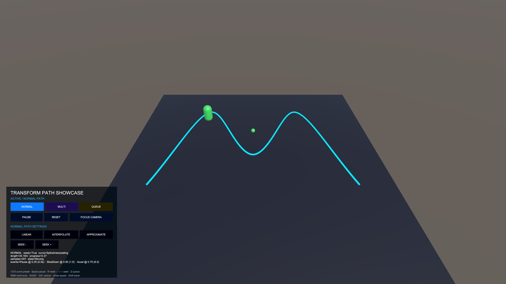
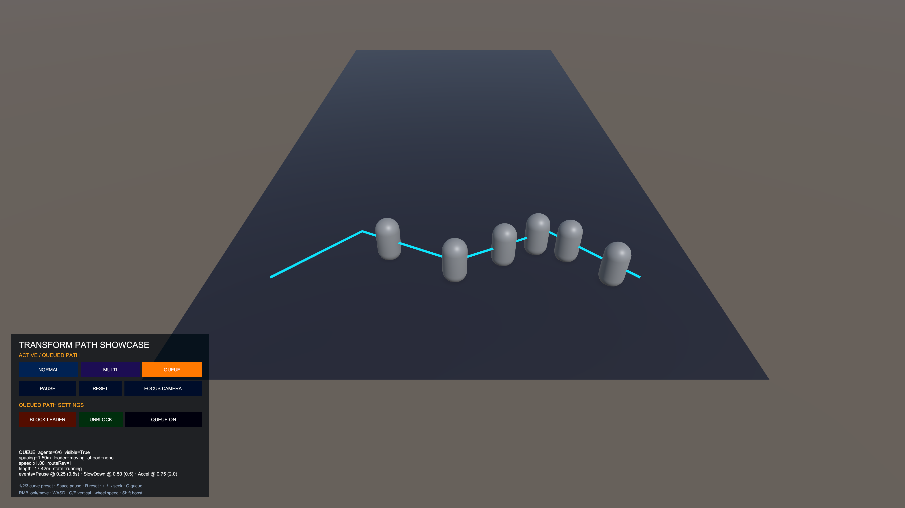
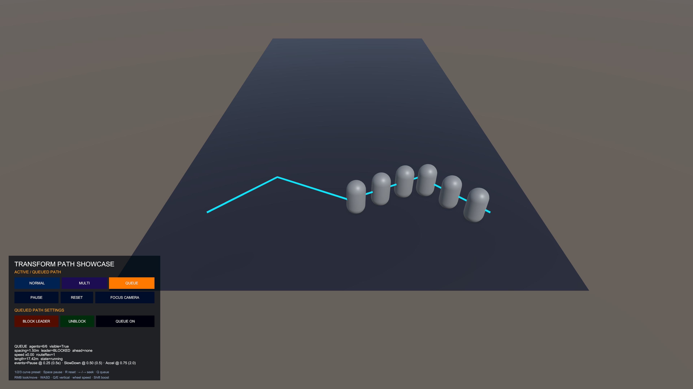
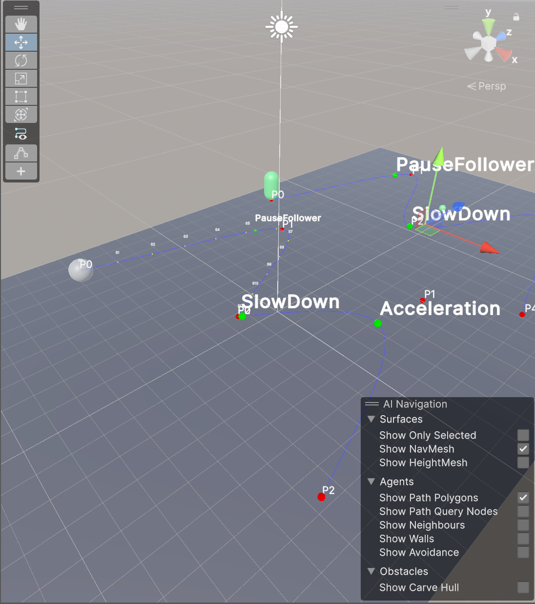
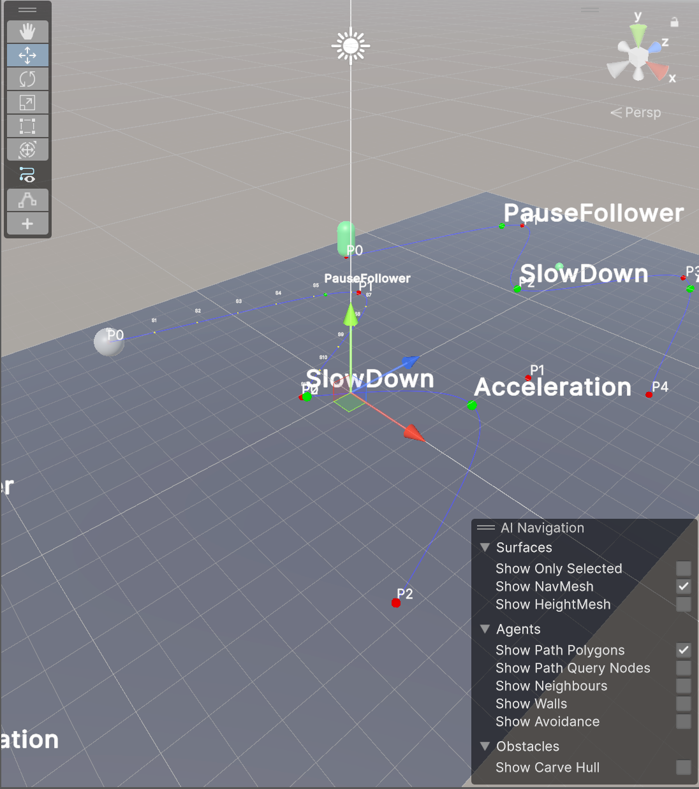

# TransformPath

Unity의 Transform 제어점으로 경로를 만들고, 동일한 런타임 API로 단일 경로·연결 경로·대기열 이동을 재생하는 시스템입니다. `Common.TransformPath` 2.0은 경로 제공자, 이동 설정, 재생 세션, 이벤트, Queue를 분리해 에디터 작성과 런타임 재생이 같은 계약을 사용하도록 구성했습니다.

## 목차

- [프로젝트 개요](#프로젝트-개요)
- [프로젝트 요약](#프로젝트-요약)
- [클래스 다이어그램](#클래스-다이어그램)
- [기능 상세](#기능-상세)

## 프로젝트 개요

| 항목 | 내용 |
| --- | --- |
| 개발 인원 | 1명 — 유원석 (You Won Sock) |
| GitHub | [youwonsock](https://github.com/youwonsock) |
| 이메일 | qazwsx233434@gmail.com |
| 프로젝트 목적 | Transform 제어점 기반 경로 생성·재생·이벤트·Queue 이동 시스템 구현 및 Unity 샘플 검증 |
| 개발 언어 | C# |
| 개발 도구 | Unity 2023.2.20f1, Visual Studio 또는 Rider |
| 샘플 표시 환경 | Universal Render Pipeline 16.0.6, UGUI (경로 런타임 API와 분리) |
| 런타임 어셈블리 | `Common.TransformPath.Runtime` |
| 에디터·샘플 어셈블리 | `Common.TransformPath.Editor`, `Common.TransformPath.Samples` |

## 프로젝트 요약

TransformPath는 씬의 Transform을 경로 제어점으로 사용하고, 경로의 기하 캐시와 이동 설정을 준비한 뒤 `PathFollower`가 동일한 재생 표면으로 이동을 수행합니다.

1. `PathData`가 두 개 이상의 Transform 제어점을 읽어 Linear, B-Spline 근사, Catmull–Rom 보간 경로를 생성합니다.
2. 경로를 일정한 샘플과 누적 거리 캐시로 변환해 정규화 좌표와 실제 거리 좌표를 모두 제공합니다.
3. `PathFollower`가 `PathPlaybackRequest.Single`, `Aggregate`, `Sequence` 중 하나를 받아 TimeBased 또는 SpeedBased로 이동합니다.
4. `PathEventHandler`가 경로상의 이벤트 설정을 검증하고 이동 값, Time.timeScale, 지연 이벤트와 프로젝트 수신기를 처리합니다.
5. `MultiPathData`는 여러 `PathData`를 순서가 있는 하나의 시퀀스로 제공하고, `QueuedPathManager`는 같은 경로를 따라가는 에이전트의 간격과 진행 한계를 계산합니다.

런타임 흐름

```text
Transform 제어점
  → PathData / MultiPathData.Rebuild()
  → IPathProvider 샘플·길이·Revision
  → PathPlaybackRequest
  → PathFollower / PathPlaybackSession
  → PathEventHandler, QueuedPathManager
  → actor Transform 갱신
```

`PathData`, `MultiPathData`, `PathFollower`, `PathEventHandler`, Queue 컴포넌트는 멱등적인 `Init`/`Release` 수명주기를 제공합니다. 직렬화된 구성이 완전하면 `Awake`에서 초기화하고, 런타임 생성 객체는 설정을 끝낸 뒤 명시적으로 `Init`할 수 있습니다. 잘못된 구성은 provider를 준비되지 않은 상태로 남기며, 재빌드는 완성된 임시 캐시를 만든 뒤 원자적으로 교체합니다. `PathChanged`가 발생할 때 `Revision`이 증가해 Queue와 재생 세션이 새 경로를 감지합니다.

## 클래스 다이어그램



핵심 관계

- `PathData`는 `IPathMovementProvider`, `IPathEventSource`를 구현하고 곡선 캐시와 초기 `PathMovementSettings`를 소유합니다.
- `MultiPathData`는 `IPathSequenceProvider`로 여러 `PathData`를 길이 가중 시퀀스로 노출합니다.
- `PathFollower`는 `PathPlaybackSession`을 소유하고 `PathPlaybackRequest`에 따라 단일·aggregate·sequence 재생을 시작합니다.
- `PathEventHandler`는 `PathEventSettingSO`를 적용하고 `IPathEventReceiver`에 이벤트 이름과 follower를 전달합니다.
- `QueuedPathManager`는 `QueuedPathFollower`를 `IQueuedPathAgent`로 등록해 동일한 route provider를 기준으로 상태를 조정합니다.

### 클래스별 역할

- `PathData`: Transform 제어점, 곡선 설정, 이동 설정, 경로 이벤트와 runtime 샘플 캐시를 관리합니다.
- `MultiPathData`: `PathSegmentConfig` 목록을 검증하고 ordered segment snapshot을 구축합니다.
- `PathFollower`: 이동 상태와 위치를 갱신하고 `Init`, `StartPlayback`, `Seek`, `PauseMove`, `ResumeMove`, `Release`를 제공합니다.
- `PathPlaybackSession`: provider Revision과 이벤트 커서, sequence snapshot을 재생 단위로 묶습니다.
- `PathEventHandler`: 이벤트 효과, 지연 scheduler, receiver 호출과 time-scale 복원을 관리합니다.
- `QueuedPathManager`: 등록 순서, 선행 에이전트, spacing slowdown, route rebuild block을 계산합니다.
- `QueuedPathFollower`: 일반 follower를 Queue agent로 연결하고 manager 상태를 이동 제약에 반영합니다.

## 기능 상세

### Transform 기반 경로 생성 및 경로 추종·재생 제어

**목적**

Transform 제어점에서 경로를 생성하고, 생성된 경로를 시간 기반 또는 속도 기반으로 추종합니다. 반복, 일시정지, 재개, Seek는 같은 `PathFollower` 수명주기에서 처리합니다.

**핵심 구현**

- `PathData`는 최소 두 개의 유효 제어점을 요구하고, `Rebuild()`에서 곡선 샘플과 누적 거리를 생성합니다.
- `PathGeometryUtility`는 Linear, cubic B-Spline 근사, Catmull–Rom 보간을 공통 샘플 버퍼로 변환합니다.
- 누적 거리 캐시로 `Sample(normalizedTime)`과 `SampleDistance(distance)`를 제공하며, `PathBuildSettings.SegmentCount`가 runtime geometry 해상도를 결정합니다.
- `PathChanged`와 Revision으로 재빌드 결과를 소비자에게 알립니다. Scene View의 `Uniform`, `DeterministicRandom`, `DistanceBased` preview sampling은 에디터 표시 전용입니다.
- `PathPlaybackRequest.Single(provider, loop)`는 `IPathMovementProvider`의 이동 설정을 사용하고, `Aggregate(provider, movement, loop)`는 해당 재생 세션에만 이동 설정을 덮어씁니다.
- `PathPlaybackRequest.Sequence(provider, loop)`는 `IPathSequenceProvider`의 세그먼트 snapshot을 사용합니다. `PathPlaybackSession`은 provider Revision, 이동 설정, 이벤트 커서를 재생 단위로 보관하고 동일 provider·Revision에서 재사용합니다.
- `PathFollower`는 `Uninitialized`, `Ready`, `Moving`, `Paused`, `Completed` 상태와 `StateChanged`, `Completed` 이벤트를 제공합니다. `Seek`와 `SeekSegment`는 위치와 이벤트 커서만 변경하며 상태를 바꾸거나 건너뛴 이벤트를 즉시 실행하지 않습니다.

<p align="center">
  
  
</p>

### MultiPath 경로 연결

**목적**

서로 다른 PathData를 하나의 route처럼 이어서 세그먼트별 속도·duration과 전역 진행률을 관리합니다.

**핵심 구현**

- `MultiPathData`의 `PathSegmentConfig`는 child `PathData`와 목적 세그먼트의 `PreservePreviousSpeed`만 저장합니다.
- `PathPlaybackRequest.Sequence(provider, loop)`가 ordered segment와 각 provider의 movement settings를 snapshot으로 만들어 재생합니다.
- `NormalizedTime`과 `CurrentSegmentIndex`는 현재 세그먼트 기준이고, `GlobalNormalizedTime`은 전체 길이에 대한 가중 진행률입니다.
- 세그먼트 경계는 `[start, end)`를 사용합니다. 자연스러운 전환에서 `PreservePreviousSpeed`가 켜져 있으면 이전 속도를 목적 세그먼트의 SpeedBased 또는 TimeBased 설정으로 변환합니다.

<p align="center">
  
  
</p>

### 경로 이벤트

**목적**

경로의 정규화 위치에서 이동과 외부 게임 상태를 변경하고, 프로젝트 코드에 이름 있는 이벤트를 전달합니다.

**핵심 구현**

- `PathData`의 이벤트 엔트리는 `0`부터 `0.995` 사이의 normalized time과 `PathEventSettingSO`를 참조합니다.
- SpeedBased에서는 목표 속도, `0` Pause, 일시정지 중 양수 값 Resume 신호를 사용합니다. TimeBased에서는 duration 설정과 `9999` Pause 규칙을 사용합니다.
- time scale 조정과 지연 이벤트는 재사용 scheduler로 처리하며, 경로상 다음 이벤트가 발생하면 취소되는 지연 항목을 지원합니다.
- `_receiverObject`가 `IPathEventReceiver`이면 `EventName`과 follower만 전달합니다. receiver·listener 예외는 fail-fast로 전파되고 뒤의 dispatch는 실행하지 않습니다.

<p align="center">
  
  
</p>

### Queue 간격 제어

**목적**

같은 경로를 따라가는 여러 actor가 일정 간격을 유지하면서 감속하고, 선두 차단과 route 변경을 안전하게 처리하도록 합니다.

**핵심 구현**

- `QueuedPathManager`는 `AgentCount`, `GetAgent`, `Register`, `Unregister`, `TryGetState`, `ConfigureRoute`를 제공합니다.
- `QueuedPathFollower`는 실제 follower가 이동 중일 때만 등록하며 spacing slowdown, overtake protection, manual block을 별도 제약으로 유지합니다.
- manager와 모든 follower는 동일한 route provider 인스턴스를 참조해야 합니다.
- 경로 geometry가 변경되면 모든 follower의 snapshot Revision이 새 Revision에 도달할 때까지 임시 차단합니다. 구조적인 segment 변경은 agent를 정지하고 등록 해제합니다.

<p align="center">
  
  
</p>

### 에디터 작성 도구

**목적**

런타임 코드를 수정하지 않고 Scene View와 Inspector에서 경로 제어점·이벤트·연결 경로를 작성하고 즉시 검증합니다.

**핵심 구현**

- `PathDataEditor`는 `Create Path Points`, `Snap to Ground`, 자손 Transform 동기화, 이벤트 정렬과 `Rebuild Runtime Path`를 제공합니다.
- 선택된 `PathData`의 제어점, 샘플점, 이벤트 위치와 경로를 색상·라벨로 그립니다.
- `MultiPathDataEditor`는 segment 목록, `Preserve Previous Speed`, 전체 PathData 적용, 모든 경로 동기화와 `Rebuild Sequence`를 제공합니다.
- Inspector 값 변경만으로 runtime cache가 자동 발행되지는 않으므로 제어점, movement, build settings 변경 후 Rebuild를 실행합니다.

<p align="center">
  
  
</p>
