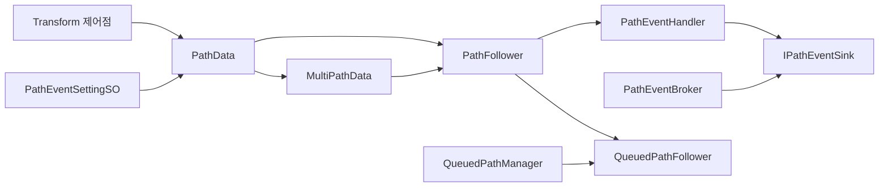

# TransformPath

Transform 제어점으로 월드 경로를 만들고, `PathFollower`가 시간/속도 기반으로 따라가며, 정규화 진행도에 이벤트를 심고, 같은 경로 위 다수 액터는 대기열로 간격을 유지하는 범용 Unity 시스템입니다.

네임스페이스: `Supercent.Common.TransformPath`

## 배포

`Assets/Supercent/Common/TransformPath` 폴더를 기본 Assembly를 사용하는 Unity 프로젝트에 복사하면 사용할 수 있습니다. Unity `2023.2.20f1`에서 사용하는 것을 기준으로 하며, 프로젝트가 자체 asmdef를 사용한다면 해당 asmdef에서 `Assembly-CSharp` 또는 TransformPath가 포함된 Assembly를 참조해야 합니다. Runtime/Editor asmdef는 포함하지 않습니다.

이 폴더는 Unity의 `MonoBehaviour`, `ScriptableObject`, `AnimationCurve`, `Transform` API만 사용합니다. 게임 규칙, 캐릭터, 판매 시스템, 시나리오 타입에는 의존하지 않습니다.

## 구성



| 영역 | 주요 타입 |
|------|-----------|
| 경로 정의 | `PathData`, `MultiPathData` |
| 이동 | `PathFollower` (이동 제어 / Animator / 다중 경로 / 경로 이벤트) |
| 이벤트 | `PathEventSettingSO`, `PathEventHandler`, `IPathEventSink`, `PathEventBroker` |
| 대기열 | `QueuedPathFollower`, `QueuedPathManager` |
| 시각화 | 에디터 기즈모 (`PathData_Editor`, `MultiPathData_Editor`), 런타임 `PathDataLineRenderer` |

## Pull 계약

외부 시스템은 concrete 타입 대신 Provider와 Controller를 보관할 수 있습니다.

```csharp
using Supercent.Common.TransformPath;
using UnityEngine;

public sealed class PathConsumer : MonoBehaviour
{
    [SerializeField] private MonoBehaviour _providerObject;
    private IPathProvider _provider;

    private void Awake()
    {
        _provider = _providerObject as IPathProvider;
    }

    private void Update()
    {
        if (_provider == null || !_provider.IsReady)
            return;

        if (_provider.TrySample(0.5f, out Vector3 position))
            transform.position = position;
    }
}
```

`TrySample`과 `TrySampleDistance`는 유한한 입력만 받고, 정규화 값과 거리는 경로 범위로 보정합니다. Provider가 준비되지 않았거나 샘플링할 수 없으면 `false`와 `Vector3.zero`를 반환합니다. 길이 0인 경로는 정규화 샘플을 제공할 수 있지만 거리 샘플은 실패합니다.

재빌드가 필요한 외부 도구는 별도로 `IPathController`를 조회합니다.

```csharp
if (_providerObject is IPathController controller)
    controller.TryRebuild(forceRebuild: true);
```

`Revision`은 최초 성공, 준비 상태 전환 또는 실제 샘플 결과가 달라진 재빌드에서 증가합니다. 변경 알림은 `PathChanged` 한 번만 게시되며, 구독자는 콜백에서 무거운 재진입 작업을 하지 말고 다음 조회 또는 기존 갱신 시점에 Provider를 다시 읽어야 합니다.

내부 계산과 캐시는 각 기능 클래스와 전용 알고리즘 타입에서 관리합니다.

## PathData

단일 경로를 정의합니다.

- Transform 리스트로 제어점을 두고, `Init` 시 월드 위치를 샘플 폴리라인으로 캐시합니다.
- 곡선 타입
  - `Linear`: 직선 연결
  - `SplineApproximating`: 3차 균일 B-스플라인(근사). 내부 웨이포인트는 곡선 위에 없을 수 있습니다.
  - `SplineInterpolating`: Catmull-Rom(보간). 모든 제어점을 통과합니다.
- `GetPointOnPath(0~1)`, `GetPointAtDistance`로 경로 위 위치를 조회합니다.
- 경로 이벤트: `PathEventEntry`(정규화 시각 + `PathEventSettingSO`). 배치 상한은 `MAX_PATH_EVENT_NORMALIZED_TIME`(0.995)입니다.
- `_segmentCount`는 실제 이동용 폴리라인 해상도입니다. `ESamplingType`(Uniform / Random / DistanceBased)은 에디터 샘플 미리보기용이며 추종 경로와 별개입니다.

## MultiPathData

여러 `PathData`를 길이 누적으로 하나의 0~1 경로처럼 취급합니다.

- 세그먼트별 `MoveType` / `Value`(TimeBased면 duration, SpeedBased면 speed) / `TimeCurve`를 설정합니다.
- 에디터 `AutoLinkPathPoints`: 인접 경로의 끝–시작 포인트 위치를 동기화합니다.

## PathFollower

경로를 따라 Transform을 이동시킵니다. **위치만** 갱신하며, 경로 접선으로 회전하지 않습니다.

- 이동 모드
  - `TimeBased`: Duration + AnimationCurve
  - `SpeedBased`: 초당 이동 거리
- `StartMove` 오버로드: 단일 `PathData`, `MultiPathData`, 설정 리스트 등
- Pause / Resume / Loop
- 세그먼트 전환 시 연속 속도 유지(`_useContinuousSpeedOnPathChange`)
- 시작점 오버라이드: 현재 위치를 첫 제어점으로 치환
- Animator 속도 연동(`SetSpeed` 등). pause 시 애니메이터 freeze를 방지하는 처리가 있습니다.

## 경로 이벤트

`PathData`에 등록된 이벤트를 `PathFollower`가 진행도에 맞춰 발화하고, `PathEventHandler`가 처리합니다.

- 이동 중 인덱스 커서로 누적 발화하고, 경로 완료 직전 남은 이벤트(끝 구간 포함)를 flush합니다.
- `PathEventSettingSO` 옵션
  - 이벤트 이름 디스패치
  - TimeScale 조정
  - SpeedBased 이동 속도 제어
  - TimeBased Duration 제어
  - 지연 이벤트(다음 경로 이벤트 트리거 시 취소)
- Sink 우선순위: 핸들러에 할당된 `IPathEventReceiver` → 없으면 `IPathEventSink` → 없으면 `PathEventBroker`의 전역 Receiver/Sink
- Receiver와 Sink를 모두 구현한 대상은 Receiver만 호출되어 중복 실행되지 않습니다.

```csharp
public sealed class MyPathReceiver : IPathEventReceiver
{
    public void ReceivePathEvent(string eventName, IPathFollower follower)
    {
        // 게임 프로젝트의 이벤트 시스템으로 전달합니다.
    }
}
```

## QueuedPath

같은 경로 위 다수 액터의 간격을 유지합니다.

- `GlobalNormalizedTime` 기준으로 앞 액터와의 거리로 정지/재개합니다.
- 점진 감속, 추월 방지, 히스테리시스, 매니저 기본 간격 공유를 지원합니다.

## 최소 사용 흐름

1. 빈 오브젝트에 `PathData`를 붙이고, 자식 Transform을 제어점으로 배치합니다.
2. 이동 오브젝트에 `PathFollower` + `PathEventHandler`를 붙입니다. (`PathFollower` Reset 시 핸들러가 자동 추가됩니다.)
3. PathData를 할당한 뒤 `StartMove`를 호출하거나 Auto Start를 켭니다.
4. (선택) PathData에 `PathEventSettingSO`를 정규화 시각에 배치합니다.
5. (선택) 다수 액터면 `QueuedPathManager`와 각 액터의 `QueuedPathFollower`를 연결합니다.

## 주의점

- 속도 제어 이벤트는 SpeedBased, Duration 제어는 TimeBased에서만 동작합니다.
- 경로 이벤트 시각 상한은 1.0이 아니라 0.995입니다.
- 지연 이벤트는 다음 경로 이벤트에서 일괄 취소됩니다.
- PathData 캐시는 Init 시점의 월드 위치입니다. 제어점을 움직이면 `Init(forceReinit: true)` 또는 `PathDataLineRenderer`의 재계산이 필요합니다.
- `PathFollower`는 위치만 갱신합니다. 경로 방향(LookAlong) 회전은 하지 않습니다.

## 외부 어댑터 경계

이 폴더에는 실행 주체의 타입이나 게임 규칙이 포함되지 않습니다. 특정 프로젝트의 이벤트 수신, Queue Agent 생명주기, 판매·스폰·시나리오 상태 전환은 이 폴더 바깥에서 `IPathEventReceiver`, `IPathFollower`, `IPathQueue`, `IQueuedPathAgent`를 통해 연결합니다.
